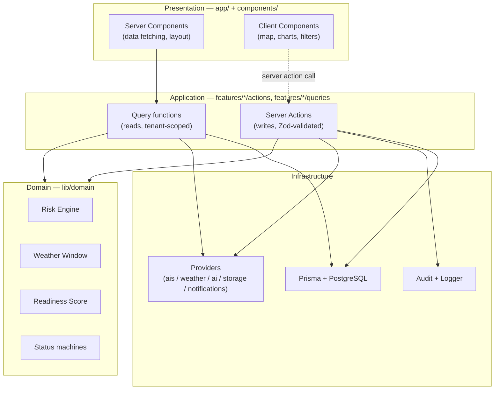
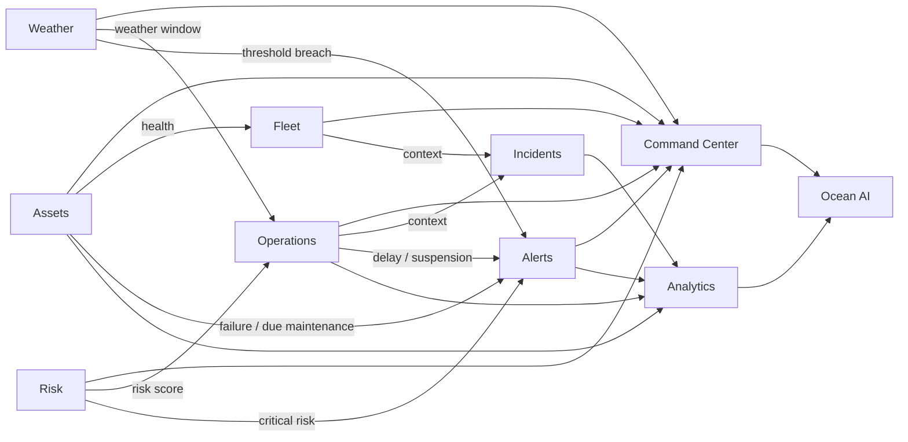
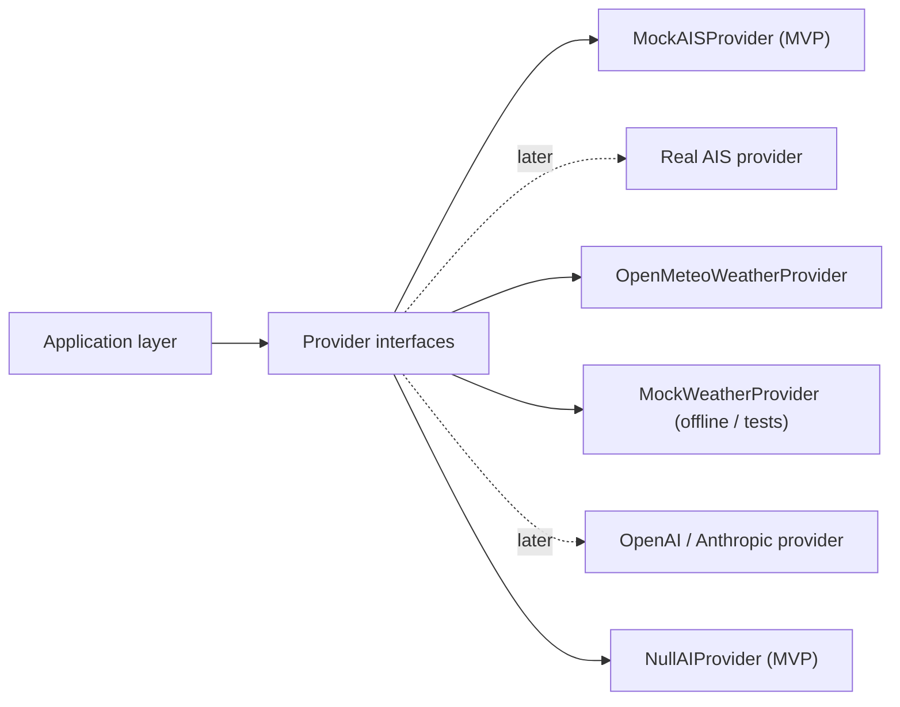

# Ocean Command — Architecture

**Offshore Operations Intelligence Platform**

> Status: **Phase 0 — Architecture**. This document describes the system that will be built.
> No application code exists yet. Nothing here should be read as "implemented".
> Implementation status is tracked in [ROADMAP.md](./ROADMAP.md) and the root `README.md`.

---

## 1. What this system is

Ocean Command is a decision-support layer for an offshore operations room. It answers, in
seconds, the question a duty coordinator asks all day:

> *What needs my attention right now, and can we keep operating?*

It is not a fleet CRUD with a map. Every module exists because a specific coordination failure
costs money or safety offshore:

| Module | Operational failure it addresses |
| --- | --- |
| Command Center | Situational picture is spread across AIS screens, e-mail, WhatsApp and spreadsheets; nobody sees the whole state at once. |
| Fleet Command | Vessel status ("what is it actually doing?") is asked by radio instead of read from a system. |
| Operations Center | Plan vs. actual drifts silently; delays are discovered at the daily report, not when they happen. |
| Environmental Intelligence | Weather is read as raw numbers and interpreted ad-hoc by each person, so go/no-go calls are inconsistent between shifts. |
| Risk Center | Risks live in an offline register that nobody opens during the operation they refer to. |
| Alert Center | Warnings are broadcast but not owned; nobody can prove a critical alert was seen. |
| Asset Monitoring | Equipment degradation is only visible after a failure stops the operation. |
| Incident Management | Incidents are reported in prose; recurrence and cause patterns are invisible. |
| Analytics | Downtime and cancellation causes are argued from memory instead of measured. |
| Ocean AI | The picture exists but reading it still takes an experienced human ten minutes. |

**Design test applied to every feature:** if we cannot name the offshore failure above, the
feature does not get built.

---

## 2. Architectural drivers

These constraints shaped every decision in [DECISIONS.md](./DECISIONS.md).

1. **Near-zero running cost.** Free tiers and open source only. No paid API is allowed on the
   MVP path (see [ADR-002](./adr/002-postgresql-and-hosting.md)).
2. **Single developer, incremental delivery.** The architecture must let one person ship one
   vertical slice per phase without breaking the previous one.
3. **Credible under technical review.** The code is a portfolio artifact read by tech leads and
   CTOs. Layering, typing and tests must survive that reading.
4. **Domain honesty.** Simulated data must be labelled as simulated everywhere it surfaces
   (§10). A demo that lies about its data destroys the argument it is trying to make.
5. **Evolvable to SaaS.** Multi-tenancy, RBAC and audit are designed in Phase 0 and enforced
   from Phase 1, because retrofitting tenant isolation into an existing schema is a rewrite.
6. **No lock-in on external data.** AIS, weather and LLM vendors are all replaceable behind
   provider interfaces (§7).

**Explicit non-goals for the MVP:** real AIS feeds, paid weather APIs, native mobile apps,
horizontal scaling, real-time collaborative editing, predictive maintenance models.

---

## 3. Architectural style: modular monolith

A single deployable Next.js application, internally split into feature modules with an enforced
dependency direction. Not microservices, and not a folder-soup monolith.

Rationale: the expensive part of this domain is the **model** (what a risk score means, what a
weather window is), not the infrastructure. A modular monolith keeps a single transaction
boundary and a single deploy while preserving clean seams. Each feature module is small enough
to be extracted into a service later if a real workload ever justifies it — see
[ADR-001](./adr/001-nextjs-modular-monolith.md).

### 3.1 Layers



### 3.2 The dependency rule

```
presentation → application → domain
                    ↓
             infrastructure
```

* **Domain never imports anything.** No Prisma, no React, no `fetch`, no `Date.now()` passed
  implicitly — time is injected. This is what makes the Risk Engine and the weather rules
  testable as pure functions.
* **Presentation never touches Prisma or a provider directly.** It calls the application layer.
* **Feature modules do not import each other's internals.** Cross-feature access goes through a
  module's public `index.ts`. Enforced by ESLint `no-restricted-imports`.
* **No external API call outside `src/providers/`.** A component calling Open-Meteo directly is
  a review blocker.

---

## 4. Module map



Two structural rules fall out of this graph:

* **Alerts is a sink, never a source.** Domain modules *emit* alerts; the Alert Center owns
  lifecycle and ownership. No module reads another module's state to decide an alert.
* **Command Center reads, never writes.** It is a composition of other modules' read models.
  This keeps the busiest page free of business logic.

---

## 5. Domain services

These three services are the intellectual core of the product. All are pure, deterministic,
injected with their configuration, and unit-tested first (Phase 4/5).

### 5.1 Risk Engine

Standard 5×5 matrix. `score = probability × impact`, both `1..5`.

| Score | Level |
| --- | --- |
| 1–4 | Low |
| 5–9 | Moderate |
| 10–16 | High |
| 17–25 | Critical |

Thresholds live in `lib/domain/risk/risk-config.ts`, not scattered in comparisons, so an
organization can later override them per tenant without touching call sites.

### 5.2 Weather Window

Evaluates a set of environmental metrics against **per-operation-type limits** and returns
`Favorable | Marginal | Unsafe` **plus the metrics that drove the verdict**. A verdict without
its reason is unusable in an operations room.

```ts
type WeatherVerdict = {
  status: 'FAVORABLE' | 'MARGINAL' | 'UNSAFE'
  breaches: Array<{ metric: string; value: number; limit: number; level: 'MARGINAL' | 'UNSAFE' }>
  evaluatedAt: Date
  source: 'SIMULATED' | 'OPEN_METEO'
}
```

Rule: the verdict is the **worst** level reached by any single metric. Default limits (MVP,
configurable per organization, marginal / unsafe):

| Operation type | Wind (kn) | Gust (kn) | Hs (m) | Visibility (NM) |
| --- | --- | --- | --- | --- |
| Diving Operation | 15 / 20 | 20 / 25 | 1.0 / 1.5 | 2 / 1 |
| ROV / Subsea Inspection | 20 / 25 | 25 / 30 | 1.5 / 2.5 | 2 / 1 |
| RPAS Inspection | 18 / 22 | 22 / 27 | 2.0 / 3.0 | 3 / 2 |
| Crew Transfer | 20 / 25 | 25 / 30 | 1.5 / 2.0 | 2 / 1 |
| Cargo / Supply Operation | 22 / 28 | 28 / 33 | 2.0 / 3.0 | 2 / 1 |
| Anchor Handling | 25 / 30 | 30 / 35 | 2.5 / 3.5 | 2 / 1 |
| Survey / Maintenance | 25 / 30 | 30 / 35 | 2.5 / 3.5 | 2 / 1 |

These are **plausible defaults for a demonstration**, not values taken from a vessel's
operations manual. The README and the UI state this. Real deployments override them per
organization and per vessel.

### 5.3 Readiness Score

Two scores, one formula family, always returned **with a breakdown**.

**Vessel Readiness Score (VRS), 0–100** — weighted mean of four sub-scores:

```
VRS = round(0.30·W + 0.30·A + 0.20·R + 0.20·O)
```

| Sub-score | Definition |
| --- | --- |
| `W` weather | Favorable 100, Marginal 60, Unsafe 15. No data → 70, result flagged `degraded`. |
| `A` assets | `100 − min(100, Σ severity(asset) × criticality(asset))`<br/>severity: Healthy 0, Attention 4, Maintenance Required 10, Failure 25<br/>criticality: Low 0.5, Medium 1, High 1.5, Critical 2 |
| `R` risks | `100 − min(100, 5 × Σ w)` over **open** risks; w: Low 0, Moderate 1, High 3, Critical 6 |
| `O` alerts | `100 − min(100, Σ w)` over unresolved alerts; w: Info 0, Low 2, Medium 5, High 12, Critical 25. Acknowledged alerts count at **half** weight — someone owns it. |

| VRS | Band |
| --- | --- |
| 85–100 | Ready |
| 70–84 | Attention |
| 50–69 | Restricted |
| 0–49 | Critical |

**Operational Readiness Score (ORS), 0–100** — organization level. Mean of vessel VRS weighted
by engagement (vessel running an active operation counts double), minus fleet-level penalties
for unresolved critical alerts not attached to any vessel. Bands map to the Command Center
status panel: `≥85 Normal`, `70–84 Attention`, `50–69 Warning`, `<50 Critical`.

Every score returns:

```ts
type ScoreBreakdown = {
  total: number
  band: 'READY' | 'ATTENTION' | 'RESTRICTED' | 'CRITICAL'
  degraded: boolean            // some input was missing
  factors: Array<{
    key: 'weather' | 'assets' | 'risks' | 'alerts'
    weight: number
    subScore: number
    contribution: number
    evidence: Array<{ entity: string; id: string; detail: string }>
  }>
}
```

The UI always exposes the breakdown on hover/click. A score a coordinator cannot audit is a
score they will not trust — and an unexplained number is worse than no number.

### 5.4 Status machines

Operation, Alert, Incident and Risk statuses are **not free-text enums updated by the UI**.
Each has an allowed-transition table in `lib/domain/<module>/transitions.ts`, checked
server-side. Illegal transitions return a typed error; every accepted transition writes an
`AuditLog` row and an event row (`OperationEvent`, `AlertEvent`).

---

## 6. Read and write paths

**Read (Server Component):**

```
page.tsx (RSC) → features/x/queries/getX(ctx, params)
               → tenant-scoped Prisma query (+ provider call if external)
               → domain projection (scores, verdicts)
               → typed view model → component
```

**Write (Server Action):**

```
client form → server action
  1. getSessionContext()        → { userId, organizationId, role }  — never trust client input
  2. Zod parse of the payload   → typed input or field errors
  3. authorize(ctx, 'op:update', resource)  → 403 on failure
  4. domain rule check          → transition allowed?
  5. Prisma transaction         → entity + event + AuditLog written together
  6. revalidatePath / revalidateTag
```

Both `organizationId` and `role` come from the server session. **No mutation ever accepts a
tenant id from the client** — that is the single most likely way this system could leak data
between organizations, so it is a hard rule rather than a convention.

---

## 7. Provider architecture

External systems are behind interfaces in `src/providers/`. Selection happens once, in a
factory reading environment configuration.



### 7.1 AIS

```ts
interface AISProvider {
  getVessels(ctx: TenantContext): Promise<VesselPositionSnapshot[]>
  getVesselPosition(ctx: TenantContext, mmsi: string): Promise<VesselPositionSnapshot | null>
  getVesselTrack(ctx: TenantContext, mmsi: string, window: TimeRange): Promise<VesselPositionSnapshot[]>
  getNearbyVessels(ctx: TenantContext, center: Coordinates, radiusNm: number): Promise<VesselPositionSnapshot[]>
}
```

MVP implementation: `MockAISProvider` — a deterministic simulator that advances each vessel
along a plausible course from its last persisted position (seeded RNG, so demos and tests
reproduce). Every snapshot carries `source: 'SIMULATED'`, which is persisted on
`VesselPosition` and rendered in the UI. Real AIS (AISStream, Spire, a coastal receiver) plugs
in by implementing the same interface; nothing above it changes.

### 7.2 Weather

```ts
interface WeatherProvider {
  getCurrentWeather(at: Coordinates): Promise<WeatherObservation>
  getForecast(at: Coordinates, hours: number): Promise<WeatherForecastPoint[]>
  getMarineForecast(at: Coordinates, hours: number): Promise<MarineForecastPoint[]>
}
```

MVP: **Open-Meteo** — free, no API key, includes a marine endpoint (wave height, swell,
period). Responses are cached in `WeatherObservation` / `WeatherForecast` with the source
recorded, so the UI reads the database and rate limits are respected. `MockWeatherProvider`
serves tests and offline development.

### 7.3 Ocean AI

Architecture built in Phase 0/1, **no LLM call until Phase 9**. The MVP ships
`NullAIProvider`, which returns an explicit "AI integration not configured" result — a visible
honest state, not a fake answer.

```ts
interface AIProvider {
  ask(ctx: TenantContext, question: string, tools: AITool[]): Promise<AIAnswer>
}

interface AITool<I = unknown, O = unknown> {
  name: string
  description: string
  input: ZodType<I>                                   // doubles as the JSON Schema sent to the model
  execute(ctx: TenantContext, input: I): Promise<O>   // tenant-scoped, read-only
}
```

Three rules fixed now because they are hard to add later:

1. **Tools are read-only in Phase 9.** No LLM-initiated writes until there is a human approval
   step. An LLM that can cancel an offshore operation is not a feature.
2. **Tools receive the caller's `TenantContext`,** so RBAC and tenant isolation apply
   identically to the AI path. The model cannot widen its own access.
3. **Answers cite their tool calls.** The UI renders which query produced each claim.

Planned tools: `getFleetStatus`, `getActiveOperations`, `getWeatherExposedOperations`,
`getCriticalAlerts`, `getAssetFailureHistory`, `getOperationalSummary`. RAG over documents and
incident reports is a later increment, not part of the initial AI slice.

### 7.4 Notifications and storage

`NotificationProvider` (MVP: in-app only; e-mail/Slack later) and `StorageProvider` (MVP: local
filesystem for `Document`; S3-compatible later). Both exist from Phase 1 so no feature is
written against a concrete implementation.

---

## 8. Rendering, data freshness and performance

* **Server Components by default.** Client Components only where interaction demands it: map,
  charts, filters, command palette, forms. Each client boundary is a deliberate decision.
* **The map is dynamically imported, `ssr: false`.** Leaflet touches `window`; it is also the
  heaviest bundle on the page.
* **Freshness by data class:** positions ~30 s, weather ~15 min (matches Open-Meteo's own
  update rate), reference data on demand. Implemented with `revalidateTag` plus client polling
  on the two live surfaces (map, alert badge). **Server-Sent Events replace polling in Phase 8
  only if measurement shows polling is actually a problem** — adding a streaming transport
  before there is load to justify it is complexity without a reason.
* **Pagination and server-side filtering on every list.** No `findMany()` without `take`.
* **Aggregates are computed in SQL,** not by loading rows into the browser. Analytics queries
  return pre-aggregated series.
* **Indexes designed with the schema,** not after the first slow page — see
  [DATABASE.md](./DATABASE.md).

---

## 9. Directory structure

```
ocean-command/
├── prisma/
│   ├── schema.prisma
│   ├── migrations/
│   └── seed/                       # deterministic demo dataset (labelled DEMO DATA)
├── docs/
│   ├── ARCHITECTURE.md  DATABASE.md  API.md  ROADMAP.md  SECURITY.md  DECISIONS.md
│   └── adr/
├── src/
│   ├── app/
│   │   ├── (auth)/                 # sign-in
│   │   ├── (platform)/             # authenticated shell: nav, search, status bar
│   │   │   ├── command-center/
│   │   │   ├── fleet/[vesselId]/
│   │   │   ├── operations/
│   │   │   ├── weather/  risk/  alerts/  assets/  incidents/  analytics/  ocean-ai/
│   │   │   └── admin/
│   │   └── api/                    # route handlers (health, webhooks, AI stream)
│   ├── components/
│   │   ├── ui/                     # shadcn primitives — no domain knowledge
│   │   └── shared/                 # StatusBadge, MetricCard, DataTable, EmptyState, ...
│   ├── features/
│   │   └── <fleet|operations|weather|risk|alerts|assets|incidents|analytics|ocean-ai>/
│   │       ├── components/         # feature UI
│   │       ├── queries/            # reads (server-only)
│   │       ├── actions/            # writes (server actions)
│   │       ├── schemas/            # Zod contracts
│   │       └── index.ts            # public surface of the module
│   ├── lib/
│   │   ├── domain/                 # pure rules: risk, weather-window, readiness, transitions
│   │   ├── auth/                   # session, authorize(), RBAC matrix
│   │   ├── db/                     # Prisma client, tenant-scoped helpers
│   │   ├── audit/  logger/  errors/  utils/
│   ├── providers/
│   │   ├── ais/  weather/  ai/  notifications/  storage/
│   ├── config/                     # env parsing (Zod), domain defaults, feature flags
│   └── types/
└── tests/
    ├── unit/                       # domain rules
    ├── integration/                # queries + actions against a real Postgres
    └── e2e/                        # Playwright, Phase 10
```

`server-only` is imported by every `queries/`, `actions/` and `providers/` module, so a
mistaken import into a Client Component fails at build time rather than leaking server code.

---

## 10. Data honesty

Every record whose origin is not a real measurement carries an explicit source:

```ts
type DataSource = 'REAL' | 'SIMULATED' | 'DEMO'
```

`VesselPosition.source`, `WeatherObservation.source` and seeded records are all tagged. The
platform shell renders a persistent **`DEMO DATA`** marker whenever the active organization is
a demo tenant, and vessel/weather cards show the source of the value they display. This is a
product requirement, not a debug aid: a demonstration that presents simulated positions as AIS
truth is indistinguishable from a broken system, and it is the one mistake this domain does not
forgive.

---

## 11. Cross-cutting concerns

**Errors.** Typed `AppError` hierarchy (`ValidationError`, `AuthorizationError`, `NotFoundError`,
`DomainRuleError`, `ProviderError`). Server actions return a discriminated result
(`{ ok: true, data } | { ok: false, error }`) instead of throwing across the boundary. Provider
failures degrade the surface that needed them — a weather outage must not blank the Command
Center; it shows a stale-data state.

**Logging.** Structured JSON to stdout (Pino), with `requestId`, `organizationId`, `userId`,
`module`. No secrets, no PII beyond user id in logs.

**Audit.** `AuditLog` for every mutation: actor, organization, action, entity type/id,
before/after diff, IP, timestamp. Written **inside** the same transaction as the change, so an
audit trail can never disagree with the data.

**Observability.** Phase 10 adds `/api/health` and `/api/ready`, request-duration and
provider-latency metrics behind a token-protected endpoint, and an `ErrorTracker` interface with
a no-op default (Sentry's free tier plugs in without touching call sites).

---

## 12. Testing strategy

Tested because failure is expensive, not for a coverage number:

| Layer | Tool | What is actually tested |
| --- | --- | --- |
| Domain | Vitest | Risk matrix boundaries (4/5, 9/10, 16/17), weather verdicts at each threshold, readiness formula and bands, every status transition — legal and illegal. |
| Schemas | Vitest | Zod contracts reject malformed and hostile input. |
| Providers | Vitest + MSW | Open-Meteo response mapping, timeout and error handling, deterministic mock AIS output. |
| Application | Vitest + Testcontainers/local Postgres | Tenant isolation (org A cannot read org B — one test per query module), RBAC denial per role, audit row written on every mutation. |
| E2E | Playwright (Phase 10) | Sign in → Command Center → acknowledge a critical alert. |

Not tested: shadcn primitives, Prisma itself, getters. **Tenant-isolation and RBAC tests are
non-optional** — they are the tests that stop a security regression from shipping.

---

## 13. CI/CD

GitHub Actions on every push and PR:

```
lint  →  typecheck  →  unit + integration tests (Postgres service container)  →  build
                          ↓
                    secret scan
```

A phase is not "done" until all five are green (see the quality gate in `README.md`).
Migrations are checked for drift (`prisma migrate diff`) so a schema change without a migration
fails CI. Deployment: Vercel free tier for the app, Neon free tier for Postgres, preview
environment per PR.

---

## 14. Technical risks

| # | Risk | Impact | Mitigation |
| --- | --- | --- | --- |
| 1 | **Tenant leakage** through a query missing `organizationId`. | Critical — cross-organization data disclosure. | All access via tenant-scoped helpers that require a `TenantContext`; one isolation test per query module; code review checklist item. |
| 2 | Scope is very large for one developer; risk of ten half-built modules. | Product looks unfinished, which is worse than being small. | Strict phase order; a phase ships a *usable vertical slice*; README marks status honestly. |
| 3 | Open-Meteo rate limits or downtime. | Weather module blank. | Persist observations/forecasts, serve from DB, show staleness, `MockWeatherProvider` fallback. |
| 4 | Simulated AIS mistaken for real data. | Credibility loss. | `source` column, UI badges, README disclosure (§10). |
| 5 | Leaflet + React re-render conflicts (imperative library in a declarative tree). | Map flicker, memory leaks. | Map isolated in one client component owning its lifecycle; markers diffed by id; no map state in React state. |
| 6 | Prisma cold starts on serverless free tier. | Slow first request. | Singleton client, connection pooling via Neon's pooled endpoint, keep queries indexed. |
| 7 | Score formulas look arbitrary to a domain expert. | The core differentiator is dismissed. | Formulas documented here, configurable per organization, always shown with their breakdown. |
| 8 | Ocean AI hallucinating operational facts. | Dangerous advice. | Read-only tool calling with tenant-scoped tools, answers cite tool results, no free-form generation about state the tools did not return. |
| 9 | shadcn/ui default look reads as "generic admin template". | Fails the product's visual goal. | Design tokens and a command-center layout defined in Phase 1 before any screen is built. |
| 10 | Next.js 16 / React 19 / Tailwind 4 / TypeScript 7 are all recent majors. | Ecosystem friction, unstable third-party types. | Pin exact versions, keep third-party dependency count low, prefer libraries with native v19 support (verified before adoption). |

---

## 15. Related documents

* [DATABASE.md](./DATABASE.md) — domain model, schema, indexes, multi-tenancy
* [SECURITY.md](./SECURITY.md) — authentication, RBAC matrix, threat model
* [API.md](./API.md) — server action and route handler contracts
* [ROADMAP.md](./ROADMAP.md) — phases and acceptance criteria
* [DECISIONS.md](./DECISIONS.md) — decision log, with ADRs in [`adr/`](./adr/)
