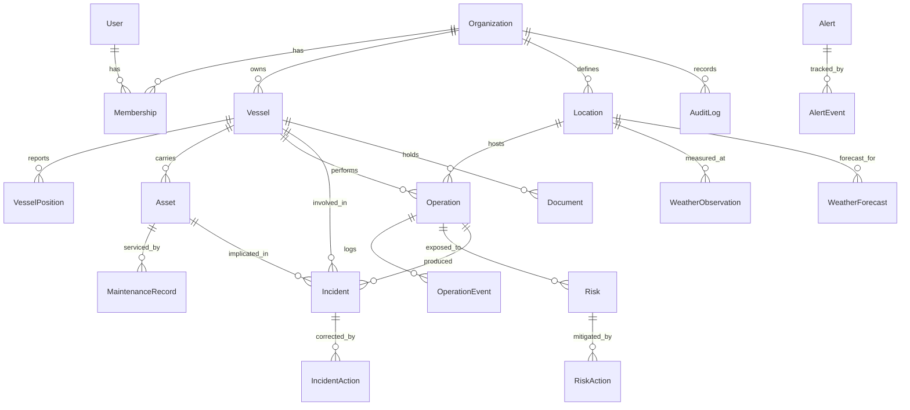

# Ocean Command — Domain and Data Model

> Status: **Phase 0 — design**. The Prisma schema below is the reference model.
> `prisma/schema.prisma` is created in Phase 1; until then, this document is the source of truth.

---

## 1. Domain model



### 1.1 Aggregates and ownership

| Aggregate root | Owns | Invariant it protects |
| --- | --- | --- |
| **Organization** | everything | Nothing crosses an organization boundary. |
| **Vessel** | positions, assets, documents | A position and an asset always belong to exactly one vessel. |
| **Operation** | events, resource assignments | Status changes only through the transition table; every change writes an event. |
| **Alert** | events, acknowledgement | An alert always has a status and, once acknowledged, an owner. |
| **Risk** | mitigation actions | `score = probability × impact` is recomputed server-side, never accepted from the client. |
| **Incident** | corrective actions, investigation | An incident cannot be closed with open corrective actions. |

### 1.2 Entities that were added to the required list, and why

* **`Membership`** instead of `User.organizationId`: the role belongs to the *pair*
  (user, organization), not to the user. Without this, adding a second tenant later means
  migrating the auth model. Cost now: one join. Cost later: a rewrite.
* **`AlertEvent` / `OperationEvent`**: "who acknowledged this alert and when" is an operational
  question and a compliance question. A `status` column alone cannot answer it.
* **`RiskAction`, `IncidentAction`, `MaintenanceRecord`**: mitigation, correction and service
  history are lists that grow over time; as text fields they are unqueryable and analytics
  becomes impossible.
* **`Location`**: operations, weather and forecasts all reference the same geographic points.
  Modelling it once keeps weather comparable across operations at the same field.

---

## 2. Multi-tenancy

Every tenant-owned table carries a non-nullable `organizationId`, and every composite index
starts with it.

**Enforcement layers (defence in depth):**

1. **Application** — data access goes through helpers that take a `TenantContext` and inject the
   filter. A raw `prisma.vessel.findMany()` outside `lib/db` is an ESLint error.
2. **Schema** — unique constraints are scoped: `@@unique([organizationId, imo])`, not
   `@unique(imo)`. Two organizations can legitimately track the same vessel.
3. **Tests** — one isolation test per query module: seed two organizations, assert org A's
   context returns zero rows of org B.
4. **Database (Phase 10 candidate)** — PostgreSQL Row-Level Security as a final backstop. Not in
   the MVP because Prisma's pooled connection does not carry a session variable reliably without
   extra wiring; recorded in [ADR-005](./adr/005-multi-tenancy.md) rather than silently skipped.

---

## 3. Conventions

| Concern | Decision |
| --- | --- |
| Primary keys | `cuid()` — collision-safe, generatable client-side, no sequence leakage of tenant volume. |
| Human codes | `OP-2026-0042`, `RSK-0104`, `INC-2026-0007`, `ALT-…` — generated per organization per year; what people say on the radio. Unique per organization. |
| Timestamps | `DateTime @db.Timestamptz(3)`, always UTC. Rendered in the organization's timezone. |
| Coordinates | `Decimal @db.Decimal(9,6)` (≈0.1 m precision). Not `Float` — rounding drift in stored positions is a real defect. |
| Money/hours | `Decimal`, never `Float`. |
| Deletion | Reference entities (`Vessel`, `Asset`, `User`, `Location`) are archived (`archivedAt`), never deleted — they are referenced by immutable history. Operational records are deleted only by an administrator, and the deletion is audited. |
| Enums | PostgreSQL native enums via Prisma. Adding a value is a migration, which is the point: statuses are domain decisions. |

---

## 4. Prisma schema (reference)

```prisma
generator client {
  provider = "prisma-client-js"
}

datasource db {
  provider = "postgresql"
  url      = env("DATABASE_URL")
}

// ─── Tenancy & identity ────────────────────────────────────────────────

model Organization {
  id           String   @id @default(cuid())
  name         String
  slug         String   @unique
  timezone     String   @default("America/Sao_Paulo")
  isDemo       Boolean  @default(false)   // drives the DEMO DATA banner
  settings     Json     @default("{}")    // risk thresholds, weather limits overrides
  createdAt    DateTime @default(now()) @db.Timestamptz(3)
  archivedAt   DateTime? @db.Timestamptz(3)

  memberships  Membership[]
  vessels      Vessel[]
  locations    Location[]
  operations   Operation[]
  assets       Asset[]
  alerts       Alert[]
  risks        Risk[]
  incidents    Incident[]
  documents    Document[]
  auditLogs    AuditLog[]
}

model User {
  id            String   @id @default(cuid())
  email         String   @unique
  name          String
  passwordHash  String?               // null for OAuth-only accounts
  emailVerified DateTime? @db.Timestamptz(3)
  image         String?
  lastLoginAt   DateTime? @db.Timestamptz(3)
  createdAt     DateTime @default(now()) @db.Timestamptz(3)
  archivedAt    DateTime? @db.Timestamptz(3)

  memberships   Membership[]
  sessions      Session[]
}

model Membership {
  id             String   @id @default(cuid())
  userId         String
  organizationId String
  role           Role
  createdAt      DateTime @default(now()) @db.Timestamptz(3)

  user           User         @relation(fields: [userId], references: [id], onDelete: Cascade)
  organization   Organization @relation(fields: [organizationId], references: [id], onDelete: Cascade)

  @@unique([userId, organizationId])
  @@index([organizationId, role])
}

model Session {
  id        String   @id @default(cuid())
  token     String   @unique
  userId    String
  expiresAt DateTime @db.Timestamptz(3)
  ipAddress String?
  userAgent String?

  user      User     @relation(fields: [userId], references: [id], onDelete: Cascade)

  @@index([userId])
}

enum Role {
  ADMINISTRATOR
  OPERATIONS_MANAGER
  OPERATOR
  VIEWER
}

// ─── Fleet ─────────────────────────────────────────────────────────────

model Vessel {
  id             String   @id @default(cuid())
  organizationId String
  name           String
  imo            String?               // 7 digits, checksum-validated
  mmsi           String?               // 9 digits
  callsign       String?
  type           VesselType
  flag           String                // ISO 3166-1 alpha-2
  operator       String?
  lengthM        Decimal? @db.Decimal(6,2)
  beamM          Decimal? @db.Decimal(5,2)
  draftM         Decimal? @db.Decimal(5,2)
  status         VesselStatus @default(AVAILABLE)

  // Denormalised last known position: the fleet map must not scan the history table.
  // Written in the same transaction that appends to VesselPosition.
  lastLatitude   Decimal? @db.Decimal(9,6)
  lastLongitude  Decimal? @db.Decimal(9,6)
  lastSpeedKn    Decimal? @db.Decimal(5,2)
  lastHeadingDeg Int?
  lastDestination String?
  lastPositionAt DateTime? @db.Timestamptz(3)
  lastPositionSource DataSource?

  createdAt      DateTime @default(now()) @db.Timestamptz(3)
  updatedAt      DateTime @updatedAt @db.Timestamptz(3)
  archivedAt     DateTime? @db.Timestamptz(3)

  organization   Organization @relation(fields: [organizationId], references: [id], onDelete: Cascade)
  positions      VesselPosition[]
  assets         Asset[]
  operations     Operation[]
  incidents      Incident[]
  risks          Risk[]
  alerts         Alert[]
  documents      Document[]

  @@unique([organizationId, imo])
  @@unique([organizationId, mmsi])
  @@index([organizationId, status])
  @@index([organizationId, archivedAt])
}

enum VesselType {
  AHTS PSV OSRV PLSV RSV DSV CSV FPSO DRILLSHIP TUG SUPPLY_VESSEL SUPPORT_VESSEL
}

enum VesselStatus {
  IN_OPERATION IN_TRANSIT STANDBY AT_PORT AVAILABLE MAINTENANCE UNAVAILABLE
}

enum DataSource {
  REAL SIMULATED DEMO
}

model VesselPosition {
  id             String   @id @default(cuid())
  organizationId String
  vesselId       String
  latitude       Decimal  @db.Decimal(9,6)
  longitude      Decimal  @db.Decimal(9,6)
  speedKn        Decimal? @db.Decimal(5,2)
  headingDeg     Int?
  courseDeg      Int?
  destination    String?
  source         DataSource
  recordedAt     DateTime @db.Timestamptz(3)

  vessel         Vessel   @relation(fields: [vesselId], references: [id], onDelete: Cascade)

  @@index([vesselId, recordedAt(sort: Desc)])
  @@index([organizationId, recordedAt(sort: Desc)])
}

// ─── Geography ─────────────────────────────────────────────────────────

model Location {
  id             String   @id @default(cuid())
  organizationId String
  name           String                       // "Santos Basin — Block SB-14"
  basin          String?                      // Santos / Campos / Espírito Santo
  type           LocationType
  latitude       Decimal  @db.Decimal(9,6)
  longitude      Decimal  @db.Decimal(9,6)
  waterDepthM    Int?

  organization   Organization @relation(fields: [organizationId], references: [id], onDelete: Cascade)
  operations     Operation[]
  observations   WeatherObservation[]
  forecasts      WeatherForecast[]

  @@unique([organizationId, name])
  @@index([organizationId, type])
}

enum LocationType {
  FIELD PLATFORM SUBSEA_SITE PORT ANCHORAGE WAYPOINT
}

// ─── Operations ────────────────────────────────────────────────────────

model Operation {
  id             String   @id @default(cuid())
  organizationId String
  code           String                        // OP-2026-0042
  name           String
  description    String?
  type           OperationType
  status         OperationStatus @default(PLANNED)
  priority       Priority        @default(MEDIUM)
  riskLevel      RiskLevel       @default(LOW)  // derived from linked risks, cached
  vesselId       String?
  locationId     String?
  responsibleId  String?
  plannedStart   DateTime  @db.Timestamptz(3)
  plannedEnd     DateTime  @db.Timestamptz(3)
  actualStart    DateTime? @db.Timestamptz(3)
  actualEnd      DateTime? @db.Timestamptz(3)
  notes          String?
  createdAt      DateTime @default(now()) @db.Timestamptz(3)
  updatedAt      DateTime @updatedAt @db.Timestamptz(3)

  organization   Organization @relation(fields: [organizationId], references: [id], onDelete: Cascade)
  vessel         Vessel?   @relation(fields: [vesselId], references: [id], onDelete: SetNull)
  location       Location? @relation(fields: [locationId], references: [id], onDelete: SetNull)
  events         OperationEvent[]
  risks          Risk[]
  incidents      Incident[]
  alerts         Alert[]

  @@unique([organizationId, code])
  @@index([organizationId, status, plannedStart])
  @@index([organizationId, vesselId, plannedStart])
}

enum OperationType {
  ROV_INSPECTION RPAS_INSPECTION CARGO_OPERATION CREW_TRANSFER ANCHOR_HANDLING
  SUBSEA_INSPECTION SURVEY DIVING_OPERATION MAINTENANCE SUPPLY_OPERATION
}

enum OperationStatus {
  PLANNED PREPARING READY IN_PROGRESS SUSPENDED COMPLETED CANCELLED
}

enum Priority { LOW MEDIUM HIGH CRITICAL }

model OperationEvent {
  id             String   @id @default(cuid())
  organizationId String
  operationId    String
  type           OperationEventType
  fromStatus     OperationStatus?
  toStatus       OperationStatus?
  message        String?
  actorId        String?
  occurredAt     DateTime @default(now()) @db.Timestamptz(3)

  operation      Operation @relation(fields: [operationId], references: [id], onDelete: Cascade)

  @@index([operationId, occurredAt(sort: Desc)])
  @@index([organizationId, occurredAt(sort: Desc)])   // powers the global activity feed
}

enum OperationEventType {
  CREATED STATUS_CHANGED RESCHEDULED NOTE_ADDED WEATHER_HOLD RESOURCE_CHANGED
}

// ─── Environment ───────────────────────────────────────────────────────

model WeatherObservation {
  id                 String   @id @default(cuid())
  organizationId     String
  locationId         String
  observedAt         DateTime @db.Timestamptz(3)
  windSpeedKn        Decimal? @db.Decimal(5,2)
  windGustKn         Decimal? @db.Decimal(5,2)
  windDirectionDeg   Int?
  waveHeightM        Decimal? @db.Decimal(4,2)   // significant wave height (Hs)
  wavePeriodS        Decimal? @db.Decimal(4,1)
  waveDirectionDeg   Int?
  swellHeightM       Decimal? @db.Decimal(4,2)
  swellPeriodS       Decimal? @db.Decimal(4,1)
  swellDirectionDeg  Int?
  precipitationMm    Decimal? @db.Decimal(5,2)
  visibilityNm       Decimal? @db.Decimal(5,2)
  pressureHpa        Decimal? @db.Decimal(6,1)
  airTempC           Decimal? @db.Decimal(4,1)
  seaTempC           Decimal? @db.Decimal(4,1)
  seaState           Int?                        // Douglas scale 0-9
  source             DataSource
  provider           String                      // "open-meteo" | "mock"

  location           Location @relation(fields: [locationId], references: [id], onDelete: Cascade)

  @@unique([locationId, observedAt, provider])
  @@index([organizationId, observedAt(sort: Desc)])
}

model WeatherForecast {
  id               String   @id @default(cuid())
  organizationId   String
  locationId       String
  forecastFor      DateTime @db.Timestamptz(3)
  issuedAt         DateTime @db.Timestamptz(3)
  windSpeedKn      Decimal? @db.Decimal(5,2)
  windGustKn       Decimal? @db.Decimal(5,2)
  windDirectionDeg Int?
  waveHeightM      Decimal? @db.Decimal(4,2)
  swellHeightM     Decimal? @db.Decimal(4,2)
  visibilityNm     Decimal? @db.Decimal(5,2)
  precipitationMm  Decimal? @db.Decimal(5,2)
  source           DataSource
  provider         String

  location         Location @relation(fields: [locationId], references: [id], onDelete: Cascade)

  @@unique([locationId, forecastFor, provider])
  @@index([organizationId, forecastFor])
}
```

Weather **verdicts are not stored**: they are derived from an observation plus the operation
type's limits. Persisting a verdict would let it drift out of sync with the thresholds that
produced it. Only the inputs are stored; the judgement is always recomputed.

```prisma
// ─── Risk ──────────────────────────────────────────────────────────────

model Risk {
  id             String   @id @default(cuid())
  organizationId String
  code           String                        // RSK-0104
  title          String
  description    String
  category       RiskCategory
  probability    Int                           // 1-5, CHECK constraint in migration
  impact         Int                           // 1-5
  score          Int                           // probability × impact, computed server-side
  level          RiskLevel                     // derived from score
  origin         String?
  operationId    String?
  vesselId       String?
  ownerId        String?
  status         RiskStatus @default(OPEN)
  reviewDate     DateTime? @db.Timestamptz(3)
  createdAt      DateTime @default(now()) @db.Timestamptz(3)
  updatedAt      DateTime @updatedAt @db.Timestamptz(3)

  operation      Operation? @relation(fields: [operationId], references: [id], onDelete: SetNull)
  vessel         Vessel?    @relation(fields: [vesselId], references: [id], onDelete: SetNull)
  actions        RiskAction[]

  @@unique([organizationId, code])
  @@index([organizationId, status, level])
  @@index([organizationId, operationId])
}

enum RiskCategory { SAFETY ENVIRONMENTAL OPERATIONAL TECHNICAL WEATHER SECURITY REGULATORY }
enum RiskLevel { LOW MODERATE HIGH CRITICAL }
enum RiskStatus { OPEN MITIGATING MONITORED CLOSED ACCEPTED }

model RiskAction {
  id          String   @id @default(cuid())
  riskId      String
  description String
  ownerId     String?
  dueDate     DateTime? @db.Timestamptz(3)
  completedAt DateTime? @db.Timestamptz(3)

  risk        Risk     @relation(fields: [riskId], references: [id], onDelete: Cascade)

  @@index([riskId])
}

// ─── Alerts ────────────────────────────────────────────────────────────

model Alert {
  id             String   @id @default(cuid())
  organizationId String
  code           String
  type           AlertType
  severity       AlertSeverity
  status         AlertStatus @default(UNREAD)
  title          String
  description    String
  sourceModule   String                        // "weather" | "asset" | "operation" | ...
  sourceRef      String?                       // id of the record that raised it
  vesselId       String?
  operationId    String?
  assetId        String?
  assigneeId     String?
  acknowledgedAt DateTime? @db.Timestamptz(3)
  acknowledgedBy String?
  resolvedAt     DateTime? @db.Timestamptz(3)
  resolvedBy     String?
  createdAt      DateTime @default(now()) @db.Timestamptz(3)

  vessel         Vessel?    @relation(fields: [vesselId], references: [id], onDelete: SetNull)
  operation      Operation? @relation(fields: [operationId], references: [id], onDelete: SetNull)
  asset          Asset?     @relation(fields: [assetId], references: [id], onDelete: SetNull)
  events         AlertEvent[]

  @@unique([organizationId, code])
  @@index([organizationId, status, severity, createdAt(sort: Desc)])
  @@index([organizationId, vesselId, status])
  @@index([organizationId, sourceModule, sourceRef])
  // Deduplication (one *open* alert per source) cannot be expressed here: it needs a
  // partial unique index. See §5 — Prisma indexes cannot carry a WHERE clause.
}

enum AlertType { WEATHER VESSEL OPERATION ASSET SAFETY RISK SYSTEM }
enum AlertSeverity { INFO LOW MEDIUM HIGH CRITICAL }
enum AlertStatus { UNREAD ACKNOWLEDGED RESOLVED }

model AlertEvent {
  id         String   @id @default(cuid())
  alertId    String
  type       AlertEventType
  actorId    String?
  note       String?
  occurredAt DateTime @default(now()) @db.Timestamptz(3)

  alert      Alert    @relation(fields: [alertId], references: [id], onDelete: Cascade)

  @@index([alertId, occurredAt(sort: Desc)])
}

enum AlertEventType { RAISED ESCALATED ASSIGNED ACKNOWLEDGED RESOLVED REOPENED COMMENTED }

// ─── Assets ────────────────────────────────────────────────────────────

model Asset {
  id                String   @id @default(cuid())
  organizationId    String
  tag               String                     // CRN-02
  name              String
  type              AssetType
  vesselId          String?
  manufacturer      String?
  model             String?
  serialNumber      String?
  status            AssetStatus @default(HEALTHY)
  condition         Int?                       // 0-100, operator assessment
  criticality       AssetCriticality @default(MEDIUM)
  operatingHours    Decimal  @default(0) @db.Decimal(10,1)
  lastMaintenanceAt DateTime? @db.Timestamptz(3)
  nextMaintenanceAt DateTime? @db.Timestamptz(3)
  createdAt         DateTime @default(now()) @db.Timestamptz(3)
  updatedAt         DateTime @updatedAt @db.Timestamptz(3)
  archivedAt        DateTime? @db.Timestamptz(3)

  vessel            Vessel?  @relation(fields: [vesselId], references: [id], onDelete: SetNull)
  maintenance       MaintenanceRecord[]
  alerts            Alert[]
  incidents         Incident[]

  @@unique([organizationId, tag])
  @@index([organizationId, status, criticality])
  @@index([organizationId, vesselId])
  @@index([organizationId, nextMaintenanceAt])
}

enum AssetType {
  CRANE WINCH PROPULSION GENERATOR THRUSTER ROV RPAS
  COMMUNICATION_SYSTEM NAVIGATION_EQUIPMENT DP_SYSTEM FIRE_SYSTEM OTHER
}
enum AssetStatus { HEALTHY ATTENTION MAINTENANCE_REQUIRED FAILURE }
enum AssetCriticality { LOW MEDIUM HIGH CRITICAL }

model MaintenanceRecord {
  id          String   @id @default(cuid())
  assetId     String
  type        MaintenanceType
  performedAt DateTime @db.Timestamptz(3)
  hoursAtService Decimal? @db.Decimal(10,1)
  description String
  performedBy String?
  downtimeH   Decimal? @db.Decimal(6,2)

  asset       Asset    @relation(fields: [assetId], references: [id], onDelete: Cascade)

  @@index([assetId, performedAt(sort: Desc)])
}

enum MaintenanceType { PREVENTIVE CORRECTIVE INSPECTION OVERHAUL }

// ─── Incidents ─────────────────────────────────────────────────────────

model Incident {
  id             String   @id @default(cuid())
  organizationId String
  code           String                        // INC-2026-0007
  occurredAt     DateTime @db.Timestamptz(3)
  reportedAt     DateTime @default(now()) @db.Timestamptz(3)
  vesselId       String?
  operationId    String?
  assetId        String?
  locationText   String?
  latitude       Decimal? @db.Decimal(9,6)
  longitude      Decimal? @db.Decimal(9,6)
  category       IncidentCategory
  severity       IncidentSeverity
  status         IncidentStatus @default(REPORTED)
  description    String
  impact         String?
  peopleInvolved Int      @default(0)
  immediateActions String?
  probableCause  String?
  investigation  String?
  reportedById   String?
  investigatorId String?
  closedAt       DateTime? @db.Timestamptz(3)

  vessel         Vessel?    @relation(fields: [vesselId], references: [id], onDelete: SetNull)
  operation      Operation? @relation(fields: [operationId], references: [id], onDelete: SetNull)
  asset          Asset?     @relation(fields: [assetId], references: [id], onDelete: SetNull)
  actions        IncidentAction[]

  @@unique([organizationId, code])
  @@index([organizationId, status, severity])
  @@index([organizationId, occurredAt(sort: Desc)])
}

enum IncidentCategory {
  PERSONAL_INJURY NEAR_MISS EQUIPMENT_DAMAGE ENVIRONMENTAL_SPILL DROPPED_OBJECT
  COLLISION FIRE LOSS_OF_POSITION SECURITY PROCESS_SAFETY OTHER
}
enum IncidentSeverity { NEGLIGIBLE MINOR MODERATE MAJOR SEVERE }
enum IncidentStatus { REPORTED UNDER_INVESTIGATION ACTION_REQUIRED RESOLVED CLOSED }

model IncidentAction {
  id          String   @id @default(cuid())
  incidentId  String
  description String
  ownerId     String?
  dueDate     DateTime? @db.Timestamptz(3)
  completedAt DateTime? @db.Timestamptz(3)

  incident    Incident @relation(fields: [incidentId], references: [id], onDelete: Cascade)

  @@index([incidentId])
}

// ─── Documents & audit ─────────────────────────────────────────────────

model Document {
  id             String   @id @default(cuid())
  organizationId String
  title          String
  category       DocumentCategory
  storageKey     String                        // provider-agnostic key
  mimeType       String
  sizeBytes      Int
  vesselId       String?
  uploadedById   String
  validFrom      DateTime? @db.Timestamptz(3)
  validUntil     DateTime? @db.Timestamptz(3)
  createdAt      DateTime @default(now()) @db.Timestamptz(3)

  vessel         Vessel?  @relation(fields: [vesselId], references: [id], onDelete: SetNull)

  @@index([organizationId, vesselId])
  @@index([organizationId, validUntil])        // expiring certificates
}

enum DocumentCategory { CERTIFICATE PROCEDURE REPORT DRAWING MANUAL PERMIT OTHER }

model AuditLog {
  id             String   @id @default(cuid())
  organizationId String
  actorId        String?
  action         String                        // "operation.status_changed"
  entityType     String
  entityId       String
  before         Json?
  after          Json?
  ipAddress      String?
  userAgent      String?
  createdAt      DateTime @default(now()) @db.Timestamptz(3)

  organization   Organization @relation(fields: [organizationId], references: [id], onDelete: Cascade)

  @@index([organizationId, createdAt(sort: Desc)])
  @@index([organizationId, entityType, entityId])
  @@index([organizationId, actorId, createdAt(sort: Desc)])
}
```

---

## 5. Constraints added by migration

Prisma cannot express these; they go into the SQL migration by hand and are covered by tests:

```sql
ALTER TABLE "Risk" ADD CONSTRAINT risk_probability_range CHECK (probability BETWEEN 1 AND 5);
ALTER TABLE "Risk" ADD CONSTRAINT risk_impact_range      CHECK (impact BETWEEN 1 AND 5);
ALTER TABLE "Risk" ADD CONSTRAINT risk_score_consistent  CHECK (score = probability * impact);

ALTER TABLE "Operation" ADD CONSTRAINT operation_planned_window
  CHECK ("plannedEnd" > "plannedStart");
ALTER TABLE "Operation" ADD CONSTRAINT operation_actual_window
  CHECK ("actualEnd" IS NULL OR "actualStart" IS NULL OR "actualEnd" >= "actualStart");

ALTER TABLE "VesselPosition" ADD CONSTRAINT position_bounds
  CHECK (latitude BETWEEN -90 AND 90 AND longitude BETWEEN -180 AND 180);

ALTER TABLE "Asset" ADD CONSTRAINT asset_condition_range
  CHECK (condition IS NULL OR condition BETWEEN 0 AND 100);

-- Alert deduplication: at most one *unresolved* alert per (source, ref, type).
-- A weather rule evaluated every 15 minutes must update the open alert, not
-- create 96 of them per day. Partial indexes have no Prisma equivalent.
CREATE UNIQUE INDEX alert_one_open_per_source
  ON "Alert" ("organizationId", "sourceModule", "sourceRef", "type")
  WHERE status <> 'RESOLVED' AND "sourceRef" IS NOT NULL;
```

`risk_score_consistent` is deliberate belt-and-braces: the score is computed by the domain layer,
and the database refuses to store a row where it disagrees.

---

## 6. Why not PostGIS (yet)

The MVP's spatial needs are: draw markers, and eventually "vessels within N nautical miles".
Marker rendering needs no spatial index, and radius search over a few dozen vessels is a
Haversine expression in SQL. PostGIS would add an extension dependency (not available on every
free tier), a heavier local setup and Prisma type friction, for zero MVP benefit.

Adoption trigger: geofencing (500 m safety zones around platforms), route/track geometry, or
polygon queries. At that point PostGIS is added as a migration — `latitude`/`longitude` are
preserved and a generated `geography(Point,4326)` column is derived from them, so no data is
lost. Recorded in [ADR-006](./adr/006-geospatial.md).

---

## 7. Growth and retention

`VesselPosition` is the only table with unbounded growth: 8 vessels × 1 fix/30 s ≈ 23 k rows/day.
Mitigations, in order of adoption:

1. Only persist a fix when the vessel moved more than 50 m or 60 s elapsed (Phase 2).
2. Retention job: raw fixes 30 days, then hourly downsample (Phase 8).
3. Monthly partitioning if the table passes ~50 M rows (not expected in the demo).

Every other table grows with human activity and needs no special treatment.

---

## 8. Seed data

`prisma/seed/` builds a deterministic scenario (fixed RNG seed) marked `isDemo: true`:

| Entity | Count |
| --- | --- |
| Organization | 2 (main demo tenant + a second one used exclusively by isolation tests) |
| User | 4 — one per role |
| Vessel | 8 — OC Atlantic, OC Horizon, OC Sentinel, OC Explorer, OC Pioneer, OC Guardian, OC Venture, OC Titan |
| Location | 6 across Santos, Campos and Espírito Santo basins |
| Operation | 20 — mixed statuses, past, active and planned |
| Asset | 25 — spread across the fleet, including two in `FAILURE` |
| Alert | 40 — all severities, some acknowledged, some resolved |
| Risk | 15 — covering every band of the matrix |
| Incident | 10 — mixed categories and statuses |
| VesselPosition | ~14 days of downsampled track per vessel |
| WeatherObservation / Forecast | 72 h of history and 48 h ahead per location |

Vessels, operators and coordinates are **fictional**. Basin names are real geography; no
operation is attributed to any real company. The seed is idempotent (`upsert` on natural keys)
and safe to re-run. Every seeded record is `DEMO`, and the UI says so.
