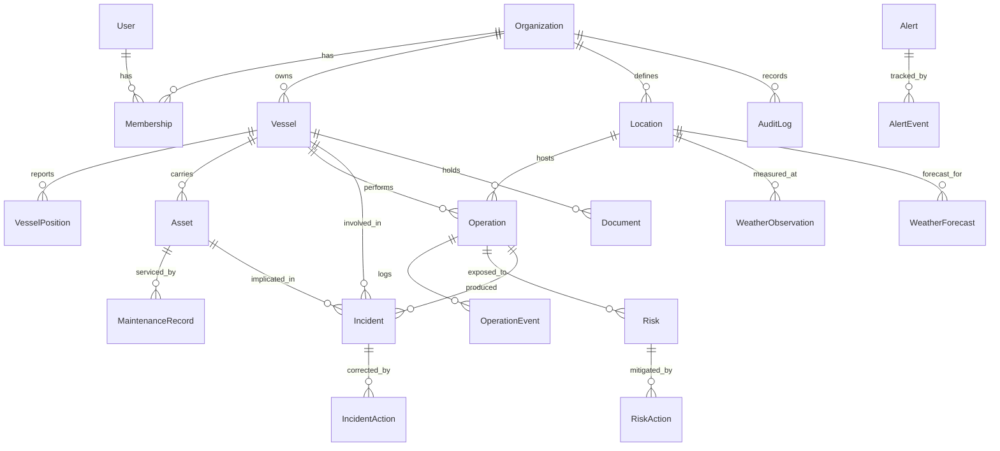

# Ocean Command — Domain and Data Model

> Status: **applied through phase 5.** The schema lives in
> [`prisma/schema.prisma`](../prisma/schema.prisma) and is applied by four migrations. This document
> explains the model and the decisions behind it; the file is the source of truth.

---

## 1. Domain model



### 1.1 Aggregates and ownership

| Aggregate root | Owns | Invariant it protects |
| --- | --- | --- |
| **Organization** | everything | Nothing crosses an organization boundary. |
| **Vessel** | positions, assets, documents | A position and an asset always belong to exactly one vessel. |
| **Operation** | events, resource assignments | Status changes only through the transition table; every change writes an event. |
| **Alert** | events, acknowledgement | An alert always has a status and, once acknowledged, an owner. |
| **Risk** | mitigation actions | `score = probability × impact` is recomputed server-side, never accepted from the client. |
| **Incident** | corrective actions, investigation | An incident cannot be closed with open corrective actions. |

### 1.2 Entities that were added to the required list, and why

* **`Membership`** instead of `User.organizationId`: the role belongs to the *pair*
  (user, organization), not to the user. Without this, adding a second tenant later means
  migrating the auth model. Cost now: one join. Cost later: a rewrite.
* **`AlertEvent` / `OperationEvent`**: "who acknowledged this alert and when" is an operational
  question and a compliance question. A `status` column alone cannot answer it.
* **`RiskAction`, `IncidentAction`, `MaintenanceRecord`**: mitigation, correction and service
  history are lists that grow over time; as text fields they are unqueryable and analytics
  becomes impossible.
* **`Location`**: operations, weather and forecasts all reference the same geographic points.
  Modelling it once keeps weather comparable across operations at the same field.

---

## 2. Multi-tenancy

Every tenant-owned table carries a non-nullable `organizationId`, and every composite index
starts with it.

**Enforcement layers (defence in depth):**

1. **Application** — data access goes through helpers that take a `TenantContext` and inject the
   filter. A raw `prisma.vessel.findMany()` outside `lib/db` is an ESLint error.
2. **Schema** — unique constraints are scoped: `@@unique([organizationId, imo])`, not
   `@unique(imo)`. Two organizations can legitimately track the same vessel.
3. **Tests** — one isolation test per query module: seed two organizations, assert org A's
   context returns zero rows of org B.
4. **Database (Phase 10 candidate)** — PostgreSQL Row-Level Security as a final backstop. Not in
   the MVP because Prisma's pooled connection does not carry a session variable reliably without
   extra wiring; recorded in [ADR-005](./adr/005-multi-tenancy.md) rather than silently skipped.

---

## 3. Conventions

| Concern | Decision |
| --- | --- |
| Primary keys | `cuid()` — collision-safe, generatable client-side, no sequence leakage of tenant volume. |
| Human codes | `OP-2026-0042`, `ALT-2026-0007`, `RSK-2026-0003`, `INC-2026-0001` — one shape, allocated per organization per year by `SequenceCounter` (§4.3); what people say on the radio. Unique per organization. |
| Timestamps | `DateTime @db.Timestamptz(3)`, always UTC. Rendered in the organization's timezone. |
| Coordinates | `Decimal @db.Decimal(9,6)` (≈0.1 m precision). Not `Float` — rounding drift in stored positions is a real defect. |
| Money/hours | `Decimal`, never `Float`. |
| Deletion | Reference entities (`Vessel`, `Asset`, `User`, `Location`) are archived (`archivedAt`), never deleted — they are referenced by immutable history. Operational records are deleted only by an administrator, and the deletion is audited. |
| Enums | PostgreSQL native enums via Prisma. Adding a value is a migration, which is the point: statuses are domain decisions. |
| Denormalised `organizationId` | On the high-volume child tables (`VesselPosition`, `OperationEvent`, `WeatherObservation`, `WeatherForecast`) the column exists **without its own foreign key**. Referential integrity comes from the parent (`vesselId`, `operationId`, `locationId`, all `onDelete: Cascade`); the column is there so the hot indexes can lead with the tenant. Deliberate denormalisation, and the seed asserts it stays consistent with the parent. |

---

## 4. The schema

**Source of truth: [`prisma/schema.prisma`](../prisma/schema.prisma).** It is applied, migrated
and tested, so it — not this document — is what the database actually looks like. Phase 0 carried
a full reference copy here; keeping a second copy in prose would guarantee the two drift apart,
and a schema document that disagrees with the schema is worse than no document.

What follows is the part a reader cannot get from the file itself: why it looks like that.

### 4.1 Identity is shaped by Better Auth

`User`, `Session`, `Account` and `Verification` follow the field names Better Auth expects, and
are mapped to lower-case table names (`@@map("user")`) to match its conventions.

Two consequences that contradict the Phase 0 design, and are worth stating plainly:

* **The password hash lives on `Account`, not `User`.** Better Auth models a credential as one
  more account provider alongside OAuth, so `User.passwordHash` was removed. The seed writes an
  `Account` row with `providerId: "credential"` — the same shape the sign-in flow reads, which is
  what makes a seeded login evidence that real authentication works.
* **`emailVerified` is a boolean, not a timestamp.** That is the library's contract; storing a
  date there would be silently ignored.

`Session.activeOrganizationId` is ours, declared to Better Auth with `input: false` so the client
cannot set it. Which tenant a session acts in is a server decision — a client-writable field there
would be a tenant-switching vulnerability.

### 4.2 Tenancy

Every tenant-owned model carries a non-nullable `organizationId`, and every composite index leads
with it. `Membership` is included: listing "the users of this organization" must not spill into
another one. Resolving *which* organization a user belongs to is the one legitimate unscoped read
of that table, and it happens in `src/lib/auth` before a tenant is known.

The registry in `src/lib/db/tenant.ts` is checked against this schema by
`tests/unit/tenant-models.test.ts`, which parses the file and fails if a model with an
`organizationId` column is not registered for scoping. That test found `Membership` missing.

### 4.3 SequenceCounter

Human-readable codes (`OP-2026-0042`, `ALT-2026-0007`, `RSK-2026-0003`) are allocated from one row per
(organization, kind, year), incremented by a single upsert. The obvious alternative — read `MAX(code)`, increment, retry on
conflict — was implemented first and **failed a ten-way concurrency test**: every retry round only
lets one caller through, so the worst case needs as many attempts as there are callers, and it breaks
exactly when the product is busy. Sequences may show gaps when a transaction takes a code and rolls
back; a gap is much cheaper than a duplicate.

`kind` is what keeps this one table instead of three near-identical ones — three places to get the
same concurrency argument wrong. It started as `OperationCounter` in phase 3 and was generalised in
phase 5, with the existing rows carried across so the operation sequence continued where it left off.

### 4.4 Denormalised last position

`Vessel` carries `lastLatitude`/`lastLongitude`/`lastPositionAt`/`lastPositionSource` alongside the
`VesselPosition` history. The fleet map reads every vessel's current position on each render, and
that must not scan a table growing by ~23 k rows a day. The denormalised copy is written in the
same transaction that appends to the history.

## 5. Constraints added by migration

Prisma cannot express these; they go into the SQL migration by hand and are covered by tests:

```sql
ALTER TABLE "Risk" ADD CONSTRAINT risk_probability_range CHECK (probability BETWEEN 1 AND 5);
ALTER TABLE "Risk" ADD CONSTRAINT risk_impact_range      CHECK (impact BETWEEN 1 AND 5);
ALTER TABLE "Risk" ADD CONSTRAINT risk_score_consistent  CHECK (score = probability * impact);

ALTER TABLE "Operation" ADD CONSTRAINT operation_planned_window
  CHECK ("plannedEnd" > "plannedStart");
ALTER TABLE "Operation" ADD CONSTRAINT operation_actual_window
  CHECK ("actualEnd" IS NULL OR "actualStart" IS NULL OR "actualEnd" >= "actualStart");

ALTER TABLE "VesselPosition" ADD CONSTRAINT position_bounds
  CHECK (latitude BETWEEN -90 AND 90 AND longitude BETWEEN -180 AND 180);

ALTER TABLE "Asset" ADD CONSTRAINT asset_condition_range
  CHECK (condition IS NULL OR condition BETWEEN 0 AND 100);

-- Alert deduplication: at most one *unresolved* alert per (source, ref, type).
-- A weather rule evaluated every 15 minutes must update the open alert, not
-- create 96 of them per day. Partial indexes have no Prisma equivalent.
CREATE UNIQUE INDEX alert_one_open_per_source
  ON "Alert" ("organizationId", "sourceModule", "sourceRef", "type")
  WHERE status <> 'RESOLVED' AND "sourceRef" IS NOT NULL;
```

`risk_score_consistent` is deliberate belt-and-braces: the score is computed by the domain layer,
and the database refuses to store a row where it disagrees.

---

## 6. Why not PostGIS (yet)

The MVP's spatial needs are: draw markers, and eventually "vessels within N nautical miles".
Marker rendering needs no spatial index, and radius search over a few dozen vessels is a
Haversine expression in SQL. PostGIS would add an extension dependency (not available on every
free tier), a heavier local setup and Prisma type friction, for zero MVP benefit.

Adoption trigger: geofencing (500 m safety zones around platforms), route/track geometry, or
polygon queries. At that point PostGIS is added as a migration — `latitude`/`longitude` are
preserved and a generated `geography(Point,4326)` column is derived from them, so no data is
lost. Recorded in [ADR-006](./adr/006-geospatial.md).

---

## 7. Growth and retention

`VesselPosition` is the only table with unbounded growth: 8 vessels × 1 fix/30 s ≈ 23 k rows/day.
Mitigations, in order of adoption:

1. **Implemented in Phase 2, with the rule corrected.** This originally read "moved more than 50 m
   **or** 60 s elapsed", which reduces nothing: the 60 s branch is true on essentially every poll,
   so everything gets stored. The implemented rule is 50 m of movement, or a 15-minute heartbeat
   while the vessel sits still — see `src/lib/domain/vessel/position-recording.ts`. Verified: two
   back-to-back syncs record no new fixes.
2. Retention job: raw fixes 30 days, then hourly downsample (Phase 8).
3. Monthly partitioning if the table passes ~50 M rows (not expected in the demo).

Every other table grows with human activity and needs no special treatment.

---

## 8. Seed data

`prisma/seed/` builds a deterministic scenario (fixed RNG seed) marked `isDemo: true`:

| Entity | Count |
| --- | --- |
| Organization | 2 (main demo tenant + a second one used exclusively by isolation tests) |
| User | 4 — one per role |
| Vessel | 8 — OC Atlantic, OC Horizon, OC Sentinel, OC Explorer, OC Pioneer, OC Guardian, OC Venture, OC Titan |
| Location | 6 across Santos, Campos and Espírito Santo basins |
| Operation | 20 — mixed statuses, past, active and planned |
| Asset | 25 — spread across the fleet, including two in `FAILURE` |
| Alert | 40 — all severities, some acknowledged, some resolved |
| Risk | 15 — covering every band of the matrix |
| Incident | 10 — mixed categories and statuses |
| VesselPosition | ~14 days of downsampled track per vessel |
| WeatherObservation / Forecast | 72 h of history and 48 h ahead per location |

Vessels, operators and coordinates are **fictional**. Basin names are real geography; no
operation is attributed to any real company. The seed is idempotent (`upsert` on natural keys)
and safe to re-run. Every seeded record is `DEMO`, and the UI says so.
